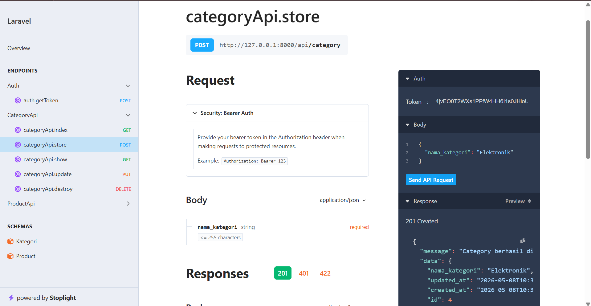
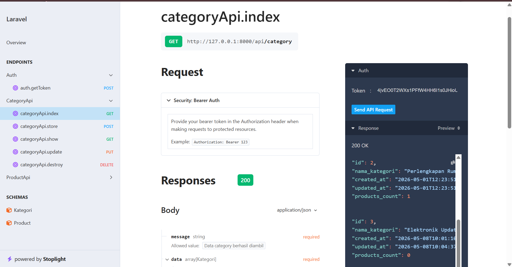
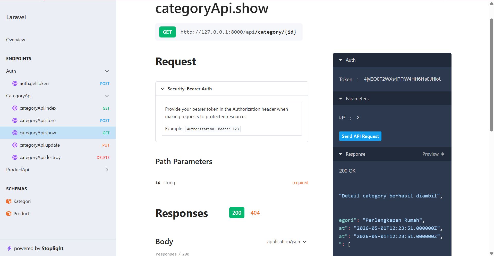
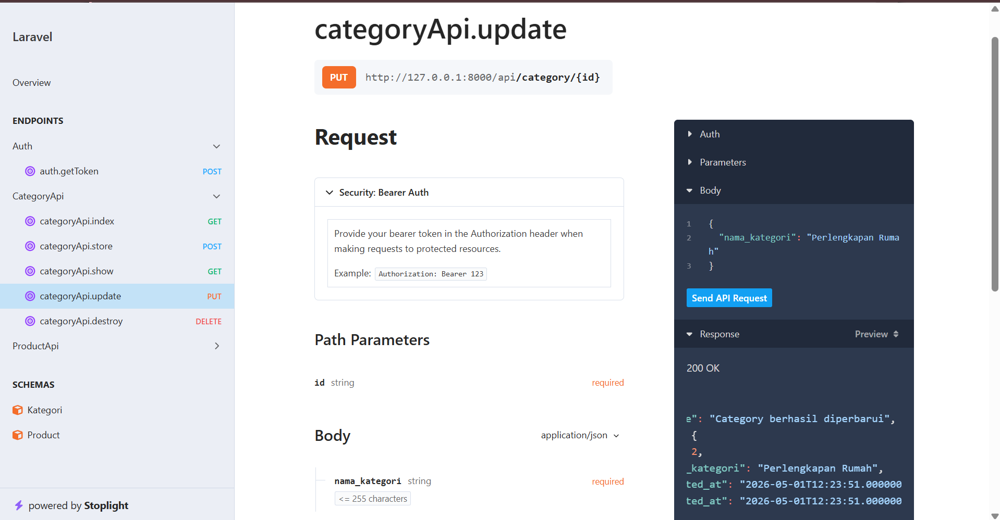
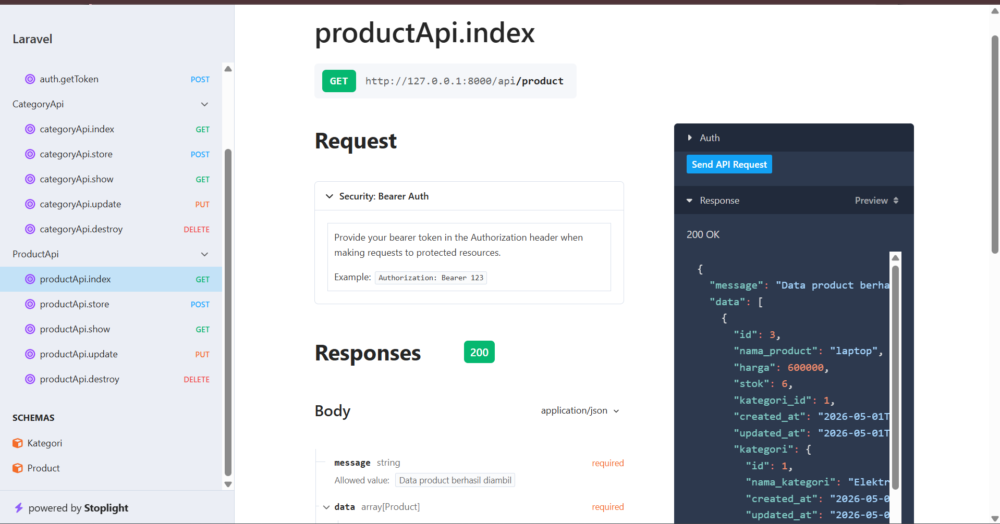
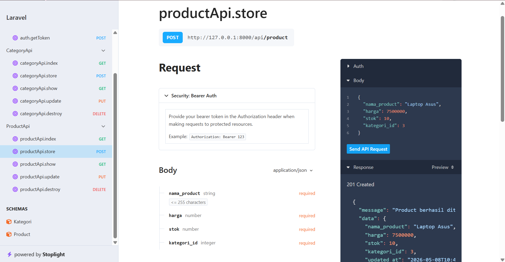
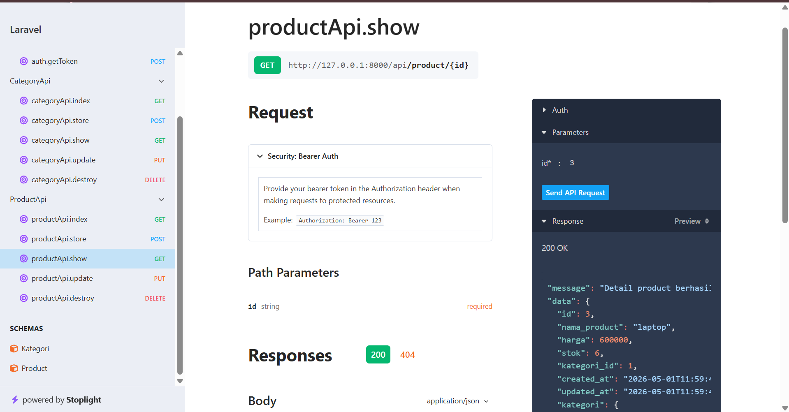
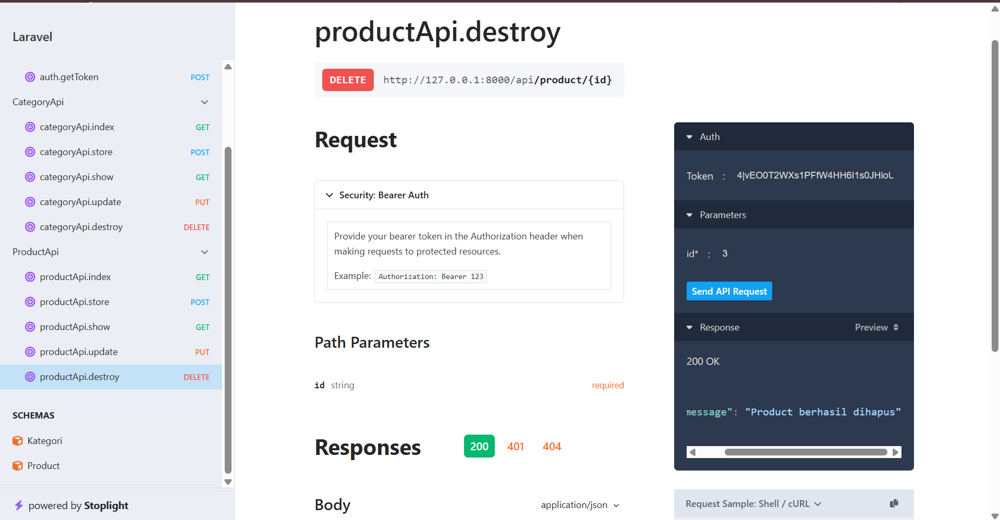
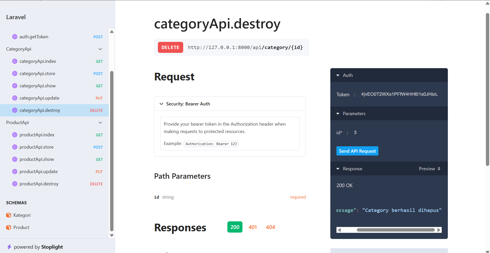

1. POST Login

2. POST Kategori

3. GET categoryAPI

4. GET categoryAPIshow

5. PUT categoryAPI

6. GET productAPI.index

7. POST productAPI.store

GET productAPI.show

8. PUT productAPI.update

9. DELETE productAPI.destroy

10. DELETE categoryAPI.destroy
